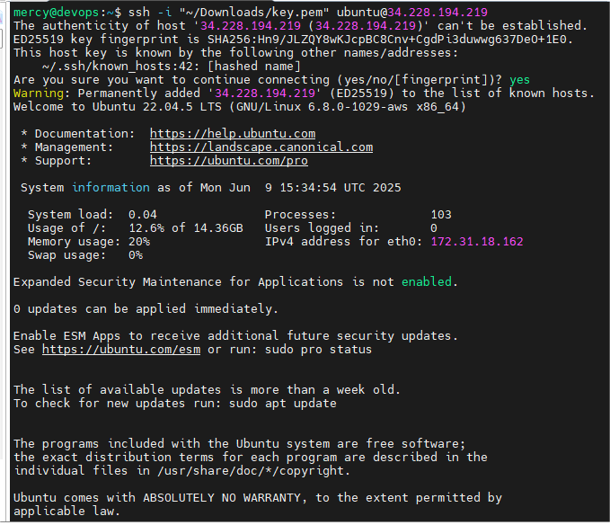
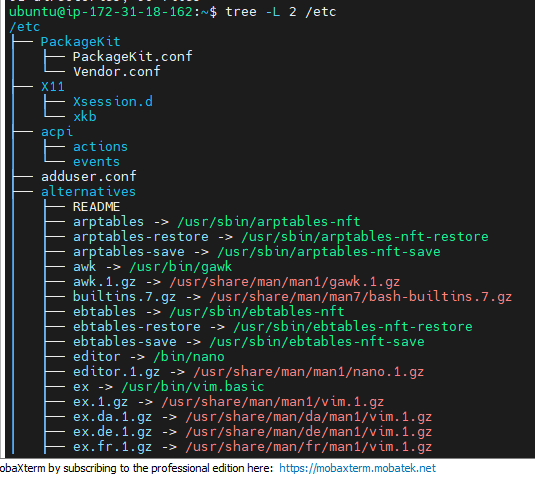

# AWS EC2 Instance Setup and Basic Server Management

This guide walks you through:

- Creating an AWS account
- Launching an EC2 instance
- Connecting to the instance via SSH
- Updating the system
- Installing and uninstalling softwares

---

##  1. Create an AWS Account

1. Go to [https://aws.amazon.com](https://aws.amazon.com)
2. Click **Create an AWS Account**

   
3. Follow the sign-up steps:
   - Provide email and password
   - Choose account type and billing information
   - Verify identity and select support plan

---

##  2. Launch an EC2 Instance

1. Sign in to AWS Management Console

   
2. Navigate to **EC2** service

   
3. Click **Launch Instance**

   
4. Configure:
   - **Name**: linux_server (or any)
   - **AMI**: Ubuntu Server (e.g., 22.04 LTS)
   - **Instance Type**: t2.micro (free tier eligible)
   - **Key Pair**:
     - Create new key pair
     - Choose **.pem** format
     - Download and **save it securely**
   - **Security Group**: Allow SSH (port 22) from your IP
5. Click **Launch Instance**
6. Wait for the instance to enter **running** state

   
7. Copy the **public IP address**

---

##  3. Connect to EC2 via SSH from Local Machine

1. Open terminal (MobaXterm, Mac, Linux)

   

2. Set permissions on your `.pem` key:

   chmod 400 /path/to/your-key.pem

   

##  4. SSH into the EC2 Instance

1.    ssh -i /path/to/your-key.pem                     ubuntu@<your-ec2-public-ip>

   

2. Update the Server

   "sudo apt update"

   

3. Install Software

   "sudo apt install tree"

   

4. Verify Software

   "tree /etc"

    

5. Upgrade Packages

   "sudo apt upgrade"

   

6. Uninstall Software

   "sudo apt remove tree"

   
7. Install Additionanal Software

   "sudo apt install nginx"

   "sudo systemctl start nginx" 

     

8. Installed Nginx Server

   "curl http://localhost"

   

9. Uninstall Additional Software

   "sudo systemctl stop nginx"

   "sudo apt remove nginx nginx-common"
   
   

## 5. Common AWS EC2 Setup Challenges
1.  Lost or Misconfigured SSH Key Pair
Issue: Cannot connect via SSH.

Cause:

.pem key not downloaded

Incorrect file permission

Wrong path or filename

Fix:

Ensure the key is saved securely when created.

Set proper permissions:
chmod 400 your-key.pem
SSH with:
ssh -i your-key.pem ubuntu@<public-ip>

2.  Using Wrong Public IP or DNS
Issue: Timeout or unreachable server.

Fix:

Use the public IPv4 address or Public DNS from the EC2 instance page.

Ensure the instance is in the running state.

3.  Wrong User in SSH Command
Issue: Permission denied or no login access.
Fix:

Use the correct default username:

Ubuntu AMI: ubuntu

Amazon Linux: ec2-user